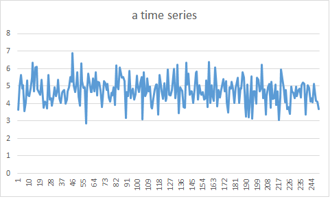
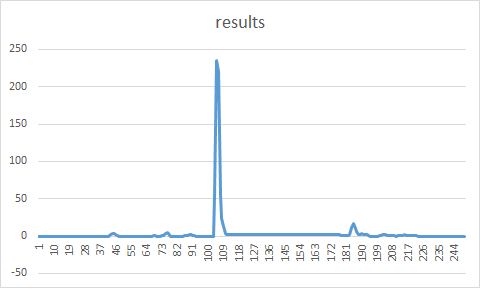
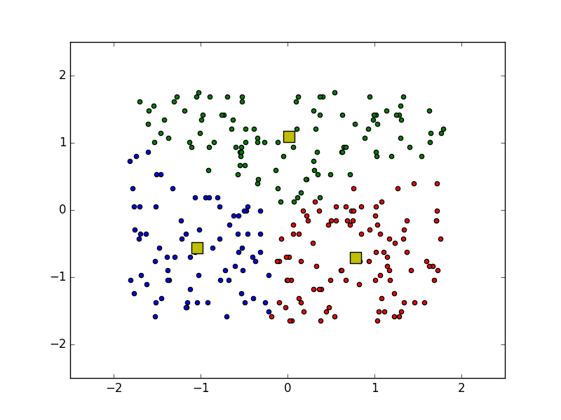

# nii-cyber-security-admin

# K-means 
  <pre>
   -bash-4.1# python km.py test.txt 
   0 739.828002664 
   1 364.390406921 
   2 361.377450751 
   3 359.252127268 
   4 355.706047096 
   5 349.6218553
   6 346.753583962 
   7 346.018573918
   8 345.671668541
   9 345.170391332 
   10 344.946493745
  </pre>

# Changepoint detection
  <pre>
  -bash-4.1# apt-get install scipy
  -bash-4.1# easy_install cython
  -bash-4.1# easy_install pandas
  -bash-4.1# easy_install -U statsmodels
  -bash-4.1# python cpd.py
  </pre>
  
  
  

# K-means with pylab plots
  <pre>
  -bash-4.1# apt-get install python-matplotlib
  -bash-4.1# python km2.py test.txt
  </pre>
  
  
  
# one-class SVM

<pre>
# git clone https://github.com/cjlin1/libsvm

Cloning into 'libsvm'...
remote: Counting objects: 3485, done.
remote: Total 3485 (delta 0), reused 0 (delta 0), pack-reused 3485
Receiving objects: 100% (3485/3485), 5.85 MiB | 189.00 KiB/s, done.
Resolving deltas: 100% (1857/1857), done.
Checking connectivity... done.

# cd libsvm/
~/libsvm# make
g++ -Wall -Wconversion -O3 -fPIC -c svm.cpp
g++ -Wall -Wconversion -O3 -fPIC svm-train.c svm.o -o svm-train -lm
g++ -Wall -Wconversion -O3 -fPIC svm-predict.c svm.o -o svm-predict -lm
g++ -Wall -Wconversion -O3 -fPIC svm-scale.c -o svm-scale

~/libsvm# cat test.cpp
~/libsvm# g++ test.cpp svm.cpp
~/libsvm# ./a.out

..*...*
optimization finished, #iter = 20
obj = 1.646537, rho = 1.646558
nSV = 4, nBSV = 0

2 2 2 2 2 1 2 2 2 2
2 2 1 1 1 1 1 1 2 2
2 1 1 1 1 1 1 1 1 2
2 1 1 1 1 1 1 1 1 2
2 1 1 1 1 1 1 1 1 1
2 1 1 1 1 1 1 1 1 1
2 1 1 1 1 1 1 1 1 2
2 1 1 1 1 1 1 1 1 2
2 2 1 1 1 1 1 1 2 2
2 2 2 2 1 1 2 2 2 2

</pre>