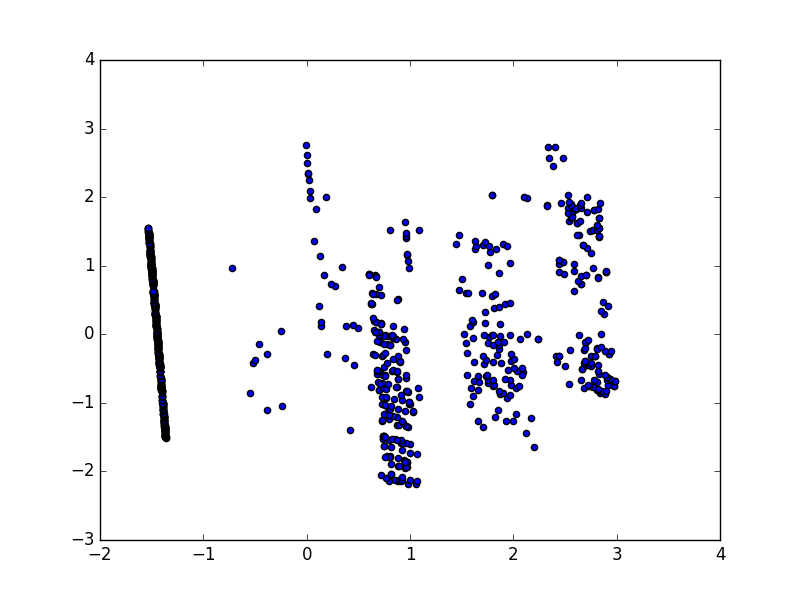

＃サイバー攻撃警報

５項目を抜き出し

<pre>
# python snort.py cyber-1000 > tmp

# more tmp
1537686,0,0,50801,400
1537687,10037,0,80,400
</pre>

正規化（匿名化）

<pre>
# python std.py tmp > tmp2
# more tmp2

1.72352515056,-1.09685423537,-0.604361524382,1.04157902662,0.438163012674
1.72699170806,0.910891179909,-0.604361524382,-0.872591881186,0.438163012674
1.73045826557,0.910291076666,-0.604361524382,-0.872591881186,0.438163012674
</pre>

クラスタリング

<pre>
# python sklearn-kmeans.py tmp2
counter0: 526
counter1: 173
counter2: 298
</pre>

