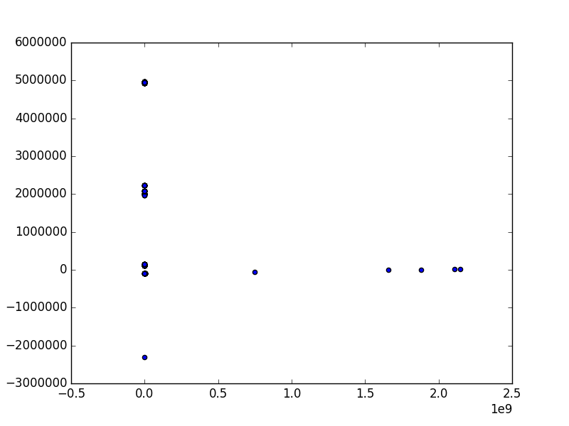

# kyotodata 20090801.txt

available at: http://www.takakura.com/Kyoto_data/

<pre>
python 1.py $1 > tmp
python 2.py tmp > tmp2
python 3.py tmp2 > tmp3
python 2.py tmp3 > tmp4
</pre>

<pre>
# python sklearn-kmeans.py tmp4
counter0: 125433
counter1: 4
counter2: 1
</pre>

PCA  
bash# python pca.py tmp4

