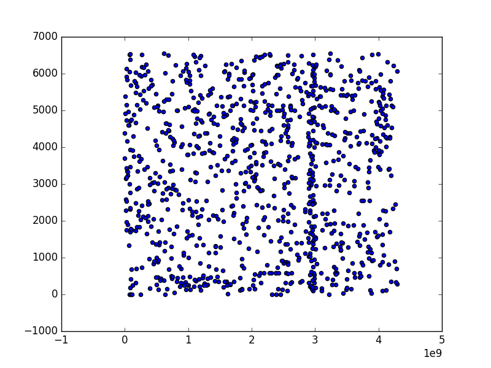
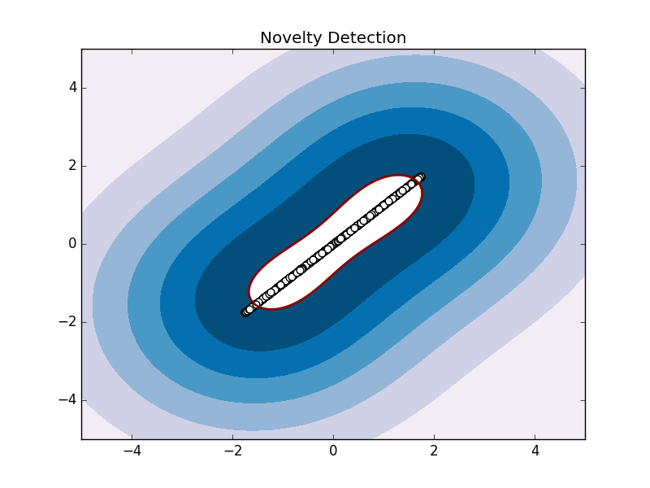

# PCA-SVM

<pre>
# g++ one-class-svm-3.cpp svm.cpp -std=c++11
# # ./a.out 100000 100000 csv-100000
</pre>

<pre>
【1】元のセッションデータから sessionID, timestamp, destIP, srcIP, destPort, srcPort, bytesを抜き出す
* * * * * * * *

【2】PCAで2次元データに圧縮
 5.65502e+21 -4.26572e+19
  1.4999e+21 -2.03554e+20

【3】libSVMで処理
optimization finished, #iter = 26451
obj = -nan, rho = 0.567472
nSV = 8837, nBSV = 0
</pre>

# PCA (power-method)

<pre>
# python power-pca.py tmp
[[ -5.36883904e+08  -5.36883904e+08]
 [ -4.07300670e+07  -4.07300670e+07]
 [ -5.20165509e+08  -5.20165509e+08]
 [ -1.32193959e+09  -1.32193959e+09]]
<pre>

CSV形式に変換
<pre>
# python 1.py tmp2 > tmp3
</pre>

<pre>
# python plot.py tmp
</pre>

<pre>
# python one-class-svm.py tmp3
</pre>

