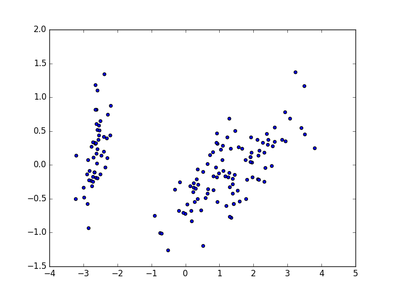
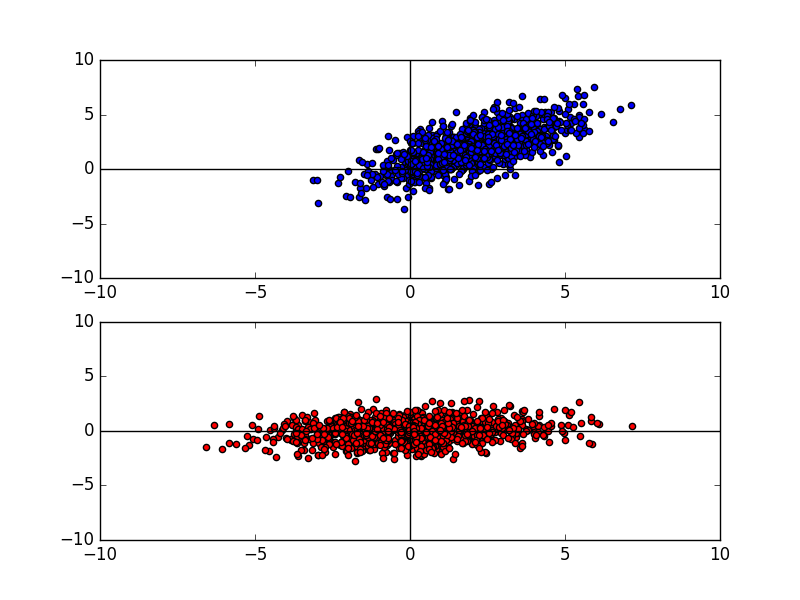

# 主成分分析(Principal Component Analysis)

# C++

<pre>
apt-get install libtnt-dev
apt-get install libjama-dev

grep PCA tmp | grep "0.00"                                                          
  0.00      0.00     0.00       20     0.00     0.00  void PCA::convert_from_string<double>(double&, std::__cxx11::basic_string<char, std::char_traits<char>, std::allocator<char> > const&)
  0.00      0.00     0.00        3     0.00     0.00  PCA::compute_covariance(TNT::Array2D<double> const&, int, int)                           
  0.00      0.00     0.00        1     0.00     0.00  _GLOBAL__sub_I__ZN3PCA5debugE                                                            
  0.00      0.00     0.00        1     0.00     0.00  PCA::adjust_data(TNT::Array2D<double>&, TNT::Array1D<double>&)                           
  0.00      0.00     0.00        1     0.00     0.00  PCA::load_data_to_Array2D(TNT::Array2D<double>&, char*&)                                 
  0.00      0.00     0.00        1     0.00     0.00  PCA::compute_covariance_matrix(TNT::Array2D<double> const&, TNT::Array2D<double>&)       
  0.00      0.00     0.00        1     0.00     0.00  PCA::eigen(TNT::Array2D<double> const&, TNT::Array2D<double>&, TNT::Array2D<double>&)    
  0.00      0.00     0.00        1     0.00     0.00  PCA::multiply(TNT::Array2D<double> const&, TNT::Array2D<double> const&, TNT::Array2D<double>&)
  0.00      0.00     0.00        1     0.00     0.00  PCA::transpose(TNT::Array2D<double> const&, TNT::Array2D<double>&)    
</pre>

<pre>

# cat test_data
2.5 2.4 3
0.5 0.7 3
2.2 2.9 3
1.9 2.2 3
3.1 3.0 3
2.3 2.7 3
2.0 1.6 3
1.0 1.1 3
1.5 1.6 3
1.1 0.9 3

# ./a.out test_data
-0.175115,0.142857,
0.82797,-1.77758,
0.992197,0.27421,
1.6758,0.912949,
-0.0991094,-1.14457,
-0.438046,-1.22382,

</pre>

# python

<pre>

S [[ 2.6774093   1.93221432]
 [ 1.93221432  3.05844013]]
la [ 0.92634075  4.80950869]
v [[-0.74098708 -0.67151928]
 [ 0.67151928 -0.74098708]]

</pre>

PCA 4 -> 2

<pre>
# cat test_csv
 1,11,111,1111,11111
 2,22,222,2222,22222
 3,33,333,3333,33333
 4,44,444,4444,44444

# python pca3.py
[[ -1.67504460e+04  -9.11548614e-12]
 [ -5.58348200e+03  -3.03967962e-12]
 [  5.58348200e+03   3.03967962e-12]
 [  1.67504460e+04   9.11548614e-12]]
</pre>