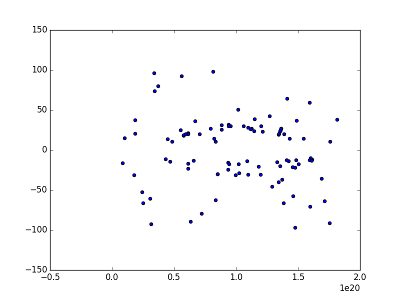

# セッションデータの次元削減

<pre>
固有値と共分散行列を作成
singular values
3.32627e+10
1.24476e+10
3.10427e+09
    31391.3
     1150.7

matrix V
    0.206962    0.0347795     0.977731 -8.22777e-06 -4.58203e-07
 2.52563e-06 -3.95099e-07  7.90371e-06     0.999686    0.0250687
    0.695082    -0.708515    -0.121929 -1.07194e-06 -6.19877e-09
    0.688496     0.704838     -0.17081 -1.10659e-07  1.01048e-08
 2.88771e-08  1.43311e-08  2.50913e-07   -0.0250687     0.999686
 
固有値の１番目、２番目に大きいものと共分散行列から射影行列を作成
 6.88411e+09      84009.3  2.31203e+10  2.29012e+10      960.529
 4.32921e+08     -4918.03 -8.81931e+09  8.77353e+09      178.387

射影行列とセッションデータをかけて２次元のデータにする。
 6.12584e+19 -1.66509e+19
 6.57824e+19 -1.33873e+19
 8.33433e+18 -1.60842e+17
 9.36857e+19 -2.43238e+19
  6.1222e+19  2.09804e+18
 9.39074e+19  3.18552e+19
 1.46169e+20 -5.77948e+18
  7.2043e+19 -7.91178e+18
 1.35786e+20  2.52935e+18
 1.59364e+20  5.93423e+18
 1.19728e+20 -3.06444e+18
 1.38538e+20  1.96934e+19
 1.48586e+20 -1.23854e+19
 1.61162e+20 -1.21221e+19
</pre>

# SVD using libeigen

<pre>
apt-get install libeigen3-dev

1 0 1 0 0 0
0 1 0 0 0 0
1 1 0 0 0 0
1 0 0 1 1 0
0 0 0 1 0 1
singular values
  2.1625
 1.59438
 1.27529
       1
0.393915
matrix V
   -0.748623    -0.286454     0.279712   3.1032e-07     0.528459 -7.05131e-08
   -0.279712    -0.528459    -0.748623  -4.4232e-07    -0.286454  5.28871e-08
   -0.203629    -0.185761     0.446563     -0.57735    -0.625521  2.98023e-08
   -0.446563     0.625521    -0.203629  4.42305e-08    -0.185761     -0.57735
   -0.325096      0.21988     0.121467     0.577351    -0.405641      0.57735
   -0.121467     0.405641    -0.325096     -0.57735      0.21988      0.57735
matrix U
   -0.440348    -0.296174     0.569498     -0.57735    -0.246402
   -0.129346    -0.331451    -0.587022 -4.34351e-07    -0.727197
    -0.47553    -0.511115     -0.36769 -8.11833e-08     0.614359
    -0.70302     0.350572     0.154906     0.577351    -0.159788
   -0.262673     0.646747    -0.414591    -0.577351    0.0866141
c_3 = 
  -1.6189 -0.604877 -0.440348 -0.965694 -0.703021 -0.262673
-0.456717 -0.842566 -0.296175   0.99732  0.350572  0.646747
 0.356714 -0.954713  0.569498 -0.259686  0.154906 -0.414591
        0         0         0         0         0         0
        0         0         0         0         0         0
cosine(0, 1) = 
0.422235
     c        c_4      c_3       c_2 
0 1.000000 1.000000 1.000000 1.000000
1 0.408248 0.422235 0.422235 0.781838
2 0.577350 0.630847 0.785422 0.950136
3 0.408248 0.418053 0.418053 0.474432
4 0.577350 0.608732 0.750473 0.740119
5 0.000000 -0.010525 -0.012915 0.110596

</pre>
