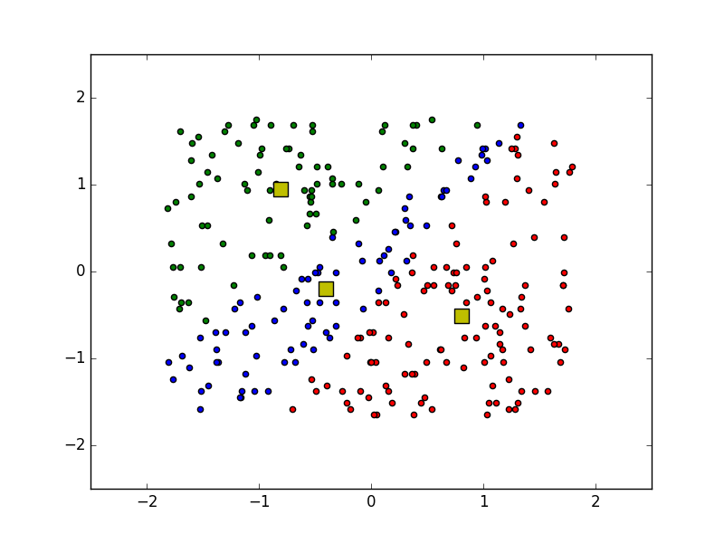
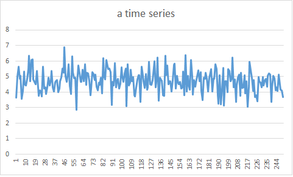

# Prototypes.

# K-means 
  <pre>
   -bash-4.1# python km.py test.txt 
   0 739.828002664 
   1 364.390406921 
   2 361.377450751 
   3 359.252127268 
   4 355.706047096 
   5 349.6218553
   6 346.753583962 
   7 346.018573918
   8 345.671668541
   9 345.170391332 
   10 344.946493745

   calculating distance ...
   data:0:[ 0.82706862 -0.76446403]
    mean:0:[-0.92139629  0.18107609]
     distance:1.98775643847
　　mean:1:[ 0.77916733 -0.15312475]
     distance:0.613213055326

</pre>

diff = 100000 
  

diff = 10000 
  

diff = 1000 
  

diff = 10 
  

diff = 0.1 
  

diff = 0.01 (default) 
  

# Changepoint detection
  <pre>
  -bash-4.1# apt-get install scipy
  -bash-4.1# easy_install cython
  -bash-4.1# easy_install pandas
  -bash-4.1# easy_install -U statsmodels
  -bash-4.1# python cpd.py
  </pre>
  
  
  

# K-means with pylab plots
  <pre>
  -bash-4.1# apt-get install python-matplotlib
  -bash-4.1# python km2.py test.txt
  </pre>
  
  
  
# one-class SVM

<pre>
# git clone https://github.com/cjlin1/libsvm

Cloning into 'libsvm'...
remote: Counting objects: 3485, done.
remote: Total 3485 (delta 0), reused 0 (delta 0), pack-reused 3485
Receiving objects: 100% (3485/3485), 5.85 MiB | 189.00 KiB/s, done.
Resolving deltas: 100% (1857/1857), done.
Checking connectivity... done.

# cd libsvm/
~/libsvm# make
g++ -Wall -Wconversion -O3 -fPIC -c svm.cpp
g++ -Wall -Wconversion -O3 -fPIC svm-train.c svm.o -o svm-train -lm
g++ -Wall -Wconversion -O3 -fPIC svm-predict.c svm.o -o svm-predict -lm
g++ -Wall -Wconversion -O3 -fPIC svm-scale.c -o svm-scale

~/libsvm# cat test.cpp
~/libsvm# g++ test.cpp svm.cpp
~/libsvm# ./a.out

..*...*
optimization finished, #iter = 20
obj = 1.646537, rho = 1.646558
nSV = 4, nBSV = 0

2 2 2 2 2 1 2 2 2 2
2 2 1 1 1 1 1 1 2 2
2 1 1 1 1 1 1 1 1 2
2 1 1 1 1 1 1 1 1 2
2 1 1 1 1 1 1 1 1 1
2 1 1 1 1 1 1 1 1 1
2 1 1 1 1 1 1 1 1 2
2 1 1 1 1 1 1 1 1 2
2 2 1 1 1 1 1 1 2 2
2 2 2 2 1 1 2 2 2 2

</pre>

SMO algorithm

<pre>

(gdb) r                                                                                                                     
(gdb) bt
#0  Solver::Solve (this=0x7fffffffe0c0, l=4, Q=..., p_=0x62ba30, y_=0x62ba60 "\001\001\001\001", alpha_=0x62ba00, Cp=1, Cn=1, eps=0.001, si=0x7fffffffe210, shrinking=1) at svm.cpp:508
#1  0x0000000000407163 in solve_one_class (prob=0x7fffffffe490, param=0x7fffffffe3e0, alpha=0x62ba00, si=0x7fffffffe210) at svm.cpp:1556
#2  0x0000000000407a03 in svm_train_one (prob=0x7fffffffe490, param=0x7fffffffe3e0, Cp=0, Cn=0) at svm.cpp:1662
#3  0x0000000000409c3b in svm_train (prob=0x7fffffffe490, param=0x7fffffffe3e0) at svm.cpp:2117
#4  0x0000000000401b22 in main () at test.cpp:77

375// An SMO algorithm in Fan et al., JMLR 6(2005), p. 1889--1918                                                        376// Solves:
378//      min 0.5(\alpha^T Q \alpha) + p^T \alpha                                                                       379//                                                                                                                    380//              y^T \alpha = \delta
381//              y_i = +1 or -1                                                                                        382//              0 <= alpha_i <= Cp for y_i = 1                                                                        383//              0 <= alpha_i <= Cn for y_i = -1                                                                       384//                                                                                                                    385// Given:                                                                                                             386//                                                                                                                    387//      Q, p, y, Cp, Cn, and an initial feasible point \alpha                                                         388//      l is the size of vectors and matrices                                                                         389//      eps is the stopping tolerance
390//                                                                                                                    391// solution will be put in \alpha, objective value will be put in obj                                                 392//                                                                                                                    393class Solver {                                                                                                        394public:                             

504void Solver::Solve(int l, const QMatrix& Q, const double *p_, const schar *y_,                                        505                   double *alpha_, double Cp, double Cn, double eps,                                                  506                   SolutionInfo* si, int shrinking)                          

</pre>

# chagepoint detection 2016-11-03

score

norm

# kmeans 2016-11-06

# python km4.py test.txt

<pre>
cluster:0:[-0.1182352   0.98402876]
cluster:1:[ 0.09153693 -0.76182872]
----
data:0:[ 0.82706862 -0.76446403][ 0.  1.]
data:1:[ 0.94206351  1.68637596][ 1.  0.]
data:2:[-1.6170452  -1.10485847][ 0.  1.]
data:3:[ 0.4749555  -1.44525292][ 0.  1.]
data:4:[ 1.01977592  1.41406041][ 1.  0.]
data:5:[ 0.46571431 -0.21983292][ 0.  1.]
data:6:[ 1.57607125 -1.37717403][ 0.  1.]
data:7:[-1.02265197 -0.96870069][ 0.  1.]
data:8:[-0.48264361  1.00558707][ 1.  0.]
data:9:[-0.09307947 -0.76446403][ 0.  1.]
data:10:[-1.70965549 -0.42406959][ 0.  1.]

# python km5.py test3.txt
cluster:0:[-0.66741648  0.88982225 -0.18090178]
cluster:1:[ -6.61486250e-04  -8.23921121e-01  -9.10713801e-01]
cluster:2:[ 0.58361258 -0.15297817  0.84827622]
----
data:0:[ 0.2683866   0.83861492  1.21339747][ 0.  0.  1.]
data:1:[ 1.62846997 -0.13684278 -0.36326244][ 0.  0.  1.]
data:2:[ 1.46204207 -0.41554498 -0.04793046][ 0.  0.  1.]
data:3:[ 0.89142325 -0.06716723  0.89806548][ 0.  0.  1.]
data:4:[-0.85037854  0.14185942  1.21339747][ 0.  0.  1.]
data:5:[-0.50249709  1.39601932 -1.62459037][ 1.  0.  0.]
data:6:[ 1.62848858  1.60504597 -0.04793046][ 0.  0.  1.]
data:7:[-0.01170643 -1.53035378  0.89806548][ 0.  0.  1.]
data:8:[-0.28658214 -0.69424718  1.52872945][ 0.  0.  1.]
data:9:[-0.84677815  0.07218387 -1.62459037][ 0.  1.  0.]

</pre>

#DBScan

<pre>
	bash# pip install scikit-learn
</pre>

<pre>
# data
# * * * * * * * *
# * * * * * 1 1 *
# * * * * * * 1 *
# * * 2 * * * * *
# * 2 2 * * * * *
# * * * * * * * *
</pre>

<pre>
	db = DBSCAN().fit(data)
	labels = db.labels_

	dbc1 = data[labels == 0] 
	dbc2 = data[labels == 1] 
	noise = data[labels == -1] 

</pre>

  
  
  
  

#DBScan pt.3

  

<pre>
80.2690002909
distance:91.6466576815
distance:42.1917222222
distance:83.2681777261
noise:set([(0.0, 0.0), (1.4791955478533605, 18.570521553772373)])
xx:[0, 61, 77, 26, 32, 95, 64, 29, 10, 31, 32, 37, 65, 32, 26, 1, 55, 69, 83, 52, 81]
yy: [0, 79, 74, 76, 73, 86, 17, 32, 71, 11, 45, 86, 22, 57, 69, 18, 88, 83, 89, 43, 42]
x1:[0 1]
y1: [ 0 18]
</pre>

  

<pre>
73.1659401866
distance:81.8481625052
distance:68.1886083559
distance:78.6825534786
distance:67.3615619552
noise:set([(83.22572009998466, 96.86577038158038), (72.40078730369939, 85.21398995280482)])
xx:[0, 41, 26, 99, 1, 34, 15, 54, 83, 94, 11, 99, 84, 72, 1, 38, 15, 66, 16, 76, 79]
yy: [0, 74, 87, 14, 89, 78, 48, 55, 96, 27, 98, 36, 55, 85, 3, 51, 2, 49, 59, 1, 18]
x1:[83 72]
y1: [96 85]
</pre>

  

<pre>
69.6680811577
distance:126.621628631
distance:42.150449604
distance:108.206749196
noise:set([(5.632671448676865, 23.954788425627108), (0.0, 0.0)])
xx:[0, 56, 63, 5, 28, 7, 69, 76, 15, 87, 78, 89, 99, 74, 23, 67, 45, 65, 61, 45, 98]
yy: [0, 77, 52, 23, 86, 60, 7, 58, 88, 26, 54, 77, 26, 9, 61, 9, 22, 38, 5, 39, 79]
x1:[5 0]
y1: [23  0]

</pre>
