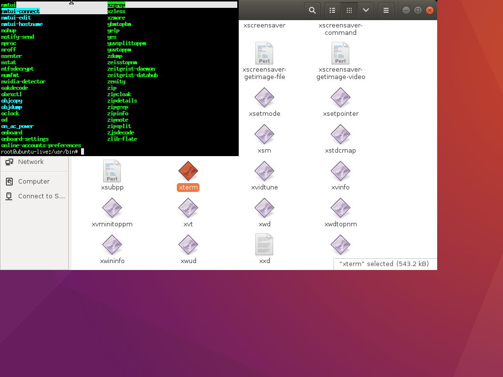

LiveDVDの作成手順

#シェルスクリプトの実行手順

bash# makerootfs.sh

<pre>
apt-get update
sudo apt install -y livecd-rootfs systemd-container xorriso
rm -rf live-build
mkdir live-build
cd live-build/
cp -a /usr/share/livecd-rootfs/live-build/auto .
cp -a /usr/share/livecd-rootfs/live-build/ubuntu-core .
PROJECT=ubuntu-core lb config
sed -i 's/precise/xenial/g' config/bootstrap
mkdir chroot
sudo lb build
sudo cp /etc/apt/sources.list chroot/etc/apt/
echo "ubuntu-live" | sudo tee chroot/etc/hostname
echo "127.0.0.1 ubuntu-live" | sudo tee chroot/etc/hosts
cp ~/nii-cyber-security-admin/livedvd/makecontainer.sh ~/nii-cyber-security-admin/livedvd/live-build/chroot/root/
cp ~/nii-cyber-security-admin/livedvd/grub.com ~/nii-cyber-security-admin/livedvd/live-build/chroot/root/
</pre>

bash# sudo chroot chroot 
bash# passwd 
bash# exit 

launch container.

bash# sudo systemd-nspawn -b -D chroot

inside container.

<pre>
root@ubuntu-live:~# time ./makecontainer.sh 

real    40m16.450s
user    3m31.720s
sys     1m22.656s

root@ubuntu-live:~# more grub.com

real    2m49.458s
user    7m35.628s
sys     0m9.100s

Disabling guest session.

root@ubuntu-live:~# vi /usr/share/lightdm/lightdm.conf.d/50-ubuntu.conf
[SeatDefaults]
user-session=ubuntu
allow-guest=false

Setting text login.

root@ubuntu-live:~# vi /etc/default/grub
GRUB_CMDLINE_LINUX_DEFAULT="quiet splash text"

root@ubuntu-live:~# shutdown -h now
</pre>

outside container.

creating iso image.
root@flare-OptiPlex-3040:~/nii-cyber-security-admin/livedvd# time ./makeisoimage.sh

<pre>
real    6m22.834s
user    8m31.892s
sys     0m13.184s
</pre>

launch liveDVD.

execute this command to launch X server.

<pre>
bash#startx -- :1
</pre>

