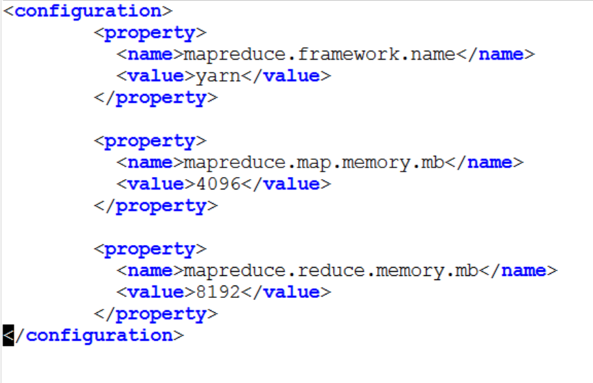
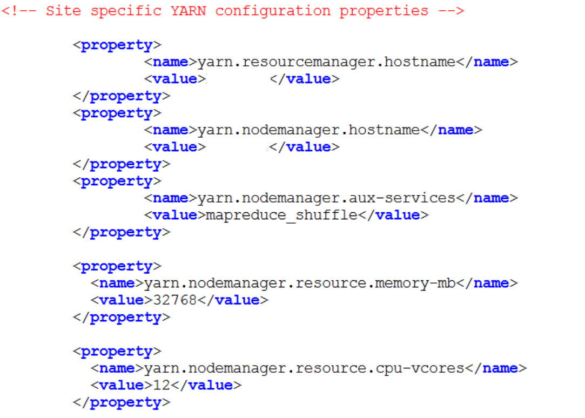

# setting up pig

<pre>
curl -s http://archive.cloudera.com/debian/archive.key | sudo apt-key add - 

sudo vim /etc/apt/sources.list.d/cdh3.list  
<xamp>
deb     http://archive.cloudera.com/debian squeeze-cdh3 contrib
deb-src http://archive.cloudera.com/debian squeeze-cdh3 contrib
</xamp>

sudo apt-get update 
sudo apt-get install hadoop-pig 
</pre>

# input.txt

<pre>
1950,0,1
1950,22,1
1950,-11,1
1949,111,1
1949,13,0
1949,78,1
</pre>

# filter

<pre>

grunt> records = LOAD 'input.txt' USING PigStorage(',') AS (year:chararray, temp:int, quality:int);
grunt> dump records

2017-03-07 10:26:18,710 [main] INFO  org.apache.pig.backend.hadoop.executionengine.util.MapRedUtil - Total input paths to process : 1
(1950,0,1)
(1950,22,1)
(1950,-11,1)
(1949,111,1)
(1949,13,0)
(1949,78,1)

grunt> filtered_records = FILTER records BY temp != 9999 AND quality == 1;
grunt> dump filtered_records

2017-03-07 10:27:10,963 [main] INFO  org.apache.pig.backend.hadoop.executionengine.util.MapRedUtil - Total input paths to process : 1
(1950,0,1)
(1950,22,1)
(1950,-11,1)
(1949,111,1)
(1949,78,1)

</pre>

# group3.py

<pre>
# python csvfilter.py session-1000 > tmp-1000 
# ./group3.sh tmp-1000
</pre>

# pig and distributed mode

Be sure that JobHistoryServer is launched.

<pre>
9203 DataNode
9492 SecondaryNameNode
10276 NodeManager
63815 Jps
9005 NameNode
9919 ResourceManager
10703 JobHistoryServer
</pre>

<pre>
mr-jobhistory-daemon.sh stop historyserver
mr-jobhistory-daemon.sh start historyserver
</pre>

# memory tuning

