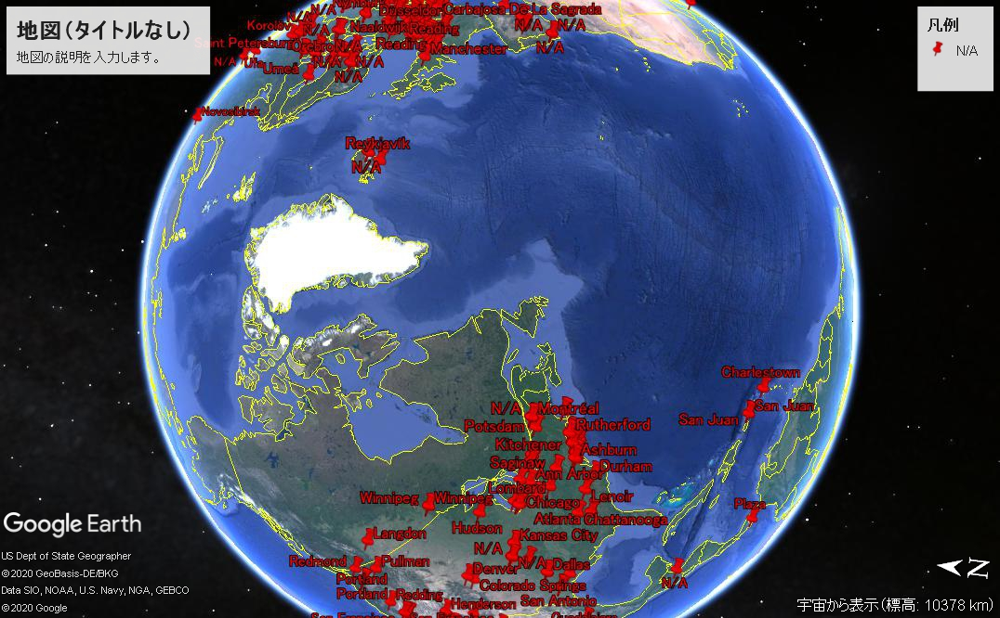

<pre>
wget https://gist.githubusercontent.com/micahflee/1ca459c2bb1cc36a6b354e3303d9fee0/raw/0673750c8c47a883387cda15966bcaf00f2a7ce4/grizzly_ips.txt
</pre>

<pre>
 1017  ./geoip.sh grizzly_ips.txt > tmp
 1021  ./kml.pl tmp > tmp2.kml
</pre>

$ head -n 3 tmp                                                                    
<pre>
101.64.234.86,GeoIP City Edition, Rev 1: CN, 02, Zhejiang, Hangzhou, N/A, 30.293600, 120.161400, 0, 0
101.98.11.146,GeoIP City Edition, Rev 1: NZ, E7, Auckland, Auckland, 1010, -36.866699, 174.766693, 0, 0
103.16.152.10,GeoIP City Edition, Rev 1: BD, 81, Dhaka, Dhaka, 1000, 23.723101, 90.408600, 0, 0
</pre>

$ cat tmp2.kml
<pre>
|?xml version="1.0" encoding="UTF-8"?|
|kml xmlns="http://www.opengis.net/kml/2.2" xmlns:gx="http://www.google.com/kml/ext/2.2" xmlns:kml="http://www.opengis.net/kml/2.2"  xmlns:atom="http://www.w3.org/2005/Atom"|
|Document|
|name|2020/10/15 14:17:59|/name|
|Folder|
|Style id="msn_ylw-pushpin1300"|
|IconStyle|
|color|ff0000ff|/color|
|scale|5|/scale|
|/IconStyle|
|LabelStyle|
|color|ff0000ff|/color|
|scale|5|/scale|
|/LabelStyle|
|/Style|
|Placemark|
|name| Hangzhou|/name|
|description|
IP:101.64.234.86 |/description|
|styleUrl|#msn_ylw-pushpin1300|/styleUrl|
</pre>

